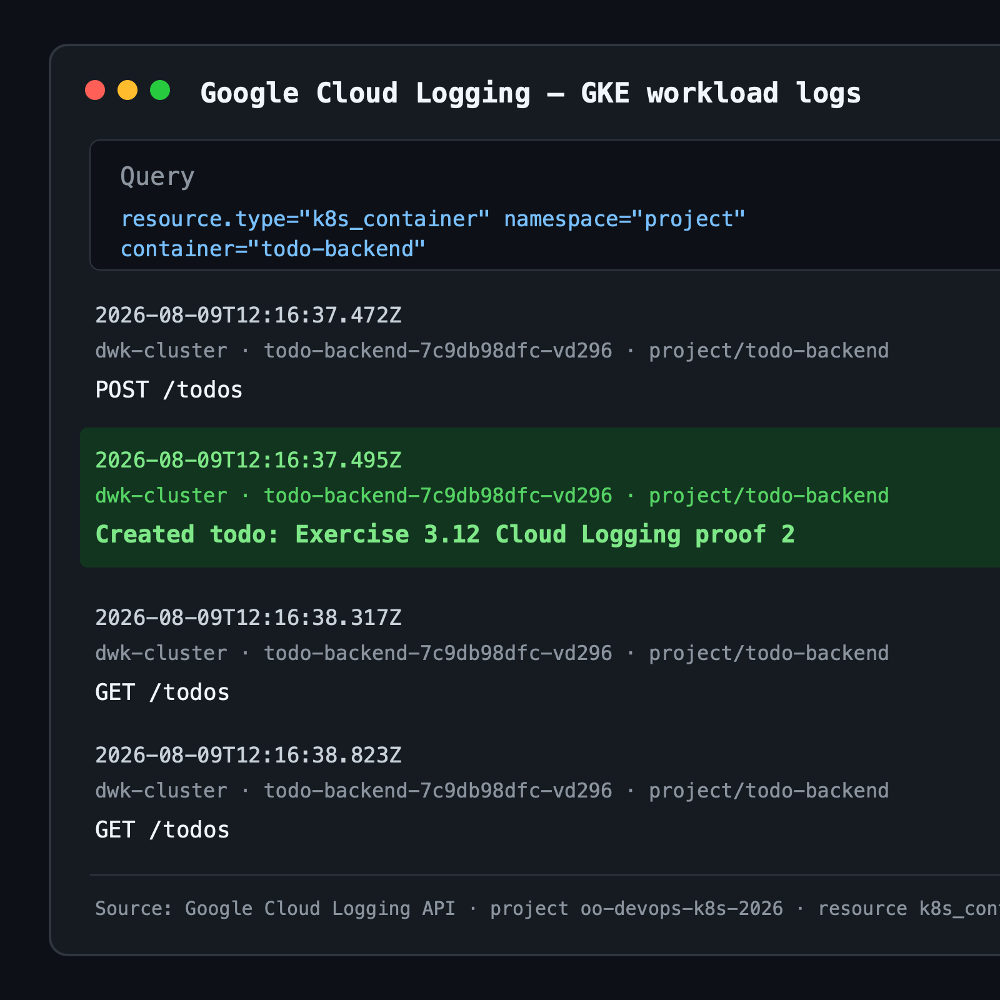

# Exercise 3.9: DBaaS vs DIY PostgreSQL

The Project currently runs PostgreSQL inside Kubernetes as a StatefulSet. An
alternative would be a managed Database as a Service (DBaaS), such as Google
Cloud SQL for PostgreSQL.

| Area | DBaaS | DIY PostgreSQL in Kubernetes |
| --- | --- | --- |
| Initial work | Create an instance, database, users, networking, and credentials. The provider supplies the database platform and documented connection options. | Design and maintain the StatefulSet, persistent storage, secrets, networking, health probes, initialization, upgrades, backups, and recovery process. Production use also needs a high-availability design. |
| Initial cost | Starts charging as soon as the managed instance is running. Cost includes provisioned compute and storage, and may include backup, network, and high-availability charges. | Can have a low additional cash cost when an existing cluster has spare capacity, but still consumes node CPU, memory, persistent disks, and engineering time. A dedicated or highly available setup adds nodes and storage and can cost as much as, or more than, DBaaS. |
| Ongoing maintenance | The provider handles the database service, infrastructure failures, many patches, monitoring integrations, and optional automated failover. The team still owns schema migrations, users, query performance, capacity choices, and application-level security. | The team owns PostgreSQL and Kubernetes operations: patching, version upgrades, replication, failover, storage capacity, monitoring, alerting, security updates, disaster recovery, and testing restores. This gives more control but creates a larger operational burden. |
| Availability and scaling | High availability, replicas, maintenance windows, and vertical scaling are usually supported as managed settings, although they increase the bill and can introduce provider-specific constraints. | Every availability and scaling mechanism must be designed and operated by the team. Scaling storage may be easy, while scaling writes, changing storage classes, or building safe failover is substantially harder. |
| Backups | Automated backups, retention policies, snapshots, and point-in-time recovery are commonly built in. Restores can usually be started through a console, CLI, or API, but retention and backup storage may cost extra. Restore procedures still need to be tested. | Backups must be implemented, secured, scheduled, monitored, retained, and copied away from the cluster. For this Project, a CronJob can run `pg_dump` and upload the result to Cloud Storage. The team must also protect credentials, manage retention, and regularly test `pg_restore`. |
| Security | The provider offers encryption, IAM integration, private networking, audit features, and managed security updates. Correct configuration and least-privilege access remain the team's responsibility. | The team has complete control over configuration and data placement, but must secure images, passwords, network access, disks, backups, PostgreSQL settings, and the Kubernetes cluster itself. |
| Portability and control | Easier to operate, but provider-specific IAM, networking, backup, and failover features can increase vendor lock-in. Some low-level database settings may be unavailable. | Maximum control over PostgreSQL versions, extensions, and configuration. Standard containers and dumps improve portability, although the Kubernetes and storage configuration still requires migration work. |

## Choice for this Project

DIY PostgreSQL is useful here because it teaches StatefulSets, persistent
volumes, secrets, and backup automation while reusing the existing course
cluster. For a small production team, DBaaS would normally be the safer choice:
its higher visible monthly price buys automated maintenance, availability, and
much simpler backup and recovery operations. DIY is reasonable when strict
control, unusual extensions, regulatory constraints, or existing database
operations expertise justify the extra work.

## Exercise 3.12: GKE application logs

GKE workload logging is enabled for the cluster. Project application logs can
be found in Cloud Logging by filtering `k8s_container` resources to namespace
`project` and container `todo-backend`.

The image below contains the Cloud Logging result after creating the Todo
`Exercise 3.12 Cloud Logging proof 2`. It shows both the incoming `POST /todos`
request and the backend's successful creation message.



## Exercise 4.2: Health checks and recovery

The Todo backend `/healthz` endpoint checks both an in-memory health flag and
the PostgreSQL connection with `SELECT 1`. Kubernetes uses the endpoint for
readiness and liveness probes. The frontend readiness probe checks the backend
health endpoint, so it is ready only when the complete application is working.

The **Break app** button sends `POST /break`. This changes the backend health
flag to false, causing the pod to become unready and then be restarted by its
liveness probe. The behavior was verified in GKE: the backend changed from
ready to unready, restarted once, returned to ready, and `/healthz` returned
HTTP 200 again.

## Exercise 4.5: Completing Todos

Todos now have a persistent boolean `done` field. The backend safely adds the
column to existing databases and exposes the required endpoint:

```http
PUT /todos/<id>
```

The Todo page shows a **Mark done** button for each open item. The frontend
uses the backend PUT endpoint, then renders completed items struck through
with a **Done** label.

Verified in GKE by creating `Exercise 4.5 completion test` as Todo ID 8,
calling `PUT /todos/8`, and reading it back from PostgreSQL with
`"done": true`. The public project page rendered the item struck through with
the **Done** label.

## Exercise 4.6: NATS broadcaster

NATS was installed with the official Helm chart:

```bash
helm repo add nats https://nats-io.github.io/k8s/helm/charts/
helm repo update
helm upgrade --install my-nats nats/nats \
  --namespace nats \
  --create-namespace \
  --set promExporter.enabled=true
```

The Todo backend publishes `todo.created` and `todo.updated` events to the
`todos.events` subject after successful database writes. The separate
broadcaster service subscribes with queue group `todo-broadcasters` and sends
the course's Generic webhook format:

```json
{ "user": "bot", "message": "A todo was created" }
```

`WEBHOOK_URL` is provided through the project ConfigMap and is set to the
approved external test endpoint `https://httpbin.org/post`. Todo contents are
not included in the external payload.

The broadcaster Deployment runs six replicas. This was verified in GKE by
creating and then completing Todo ID 10. Across the combined logs of all six
pods, `todo.created` was forwarded exactly once and `todo.updated` was
forwarded exactly once, demonstrating that the NATS queue group prevents
duplicate delivery.
