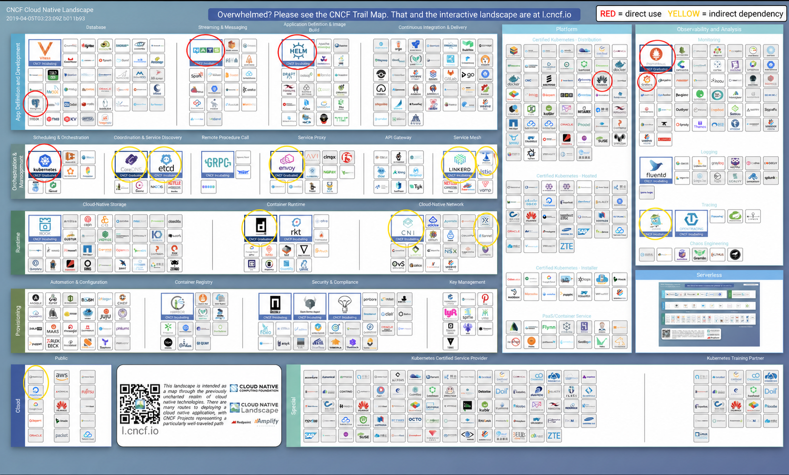

# Exercise 5.8: Landscape

Red circles show direct use; yellow circles show indirect dependencies.

- I used **PostgreSQL** for Ping-pong persistence and **NATS** for messaging.
- I used **Helm** to install Prometheus and **Prometheus/Grafana** for monitoring.
- I used **Docker** to build images and **Kubernetes** through k3d and GKE.
- I used **Istio** and **Linkerd** while completing the service-mesh exercises.
- I used **Google Cloud** to run the course's GKE workloads.
- I indirectly used **CoreDNS** and **etcd** as Kubernetes cluster components.
- I indirectly used **Envoy** through service meshes.
- I indirectly used **containerd**, **CNI**, and **Flannel** through k3s/k3d.
- I indirectly used **Jaeger** through the service-mesh observability setup.
